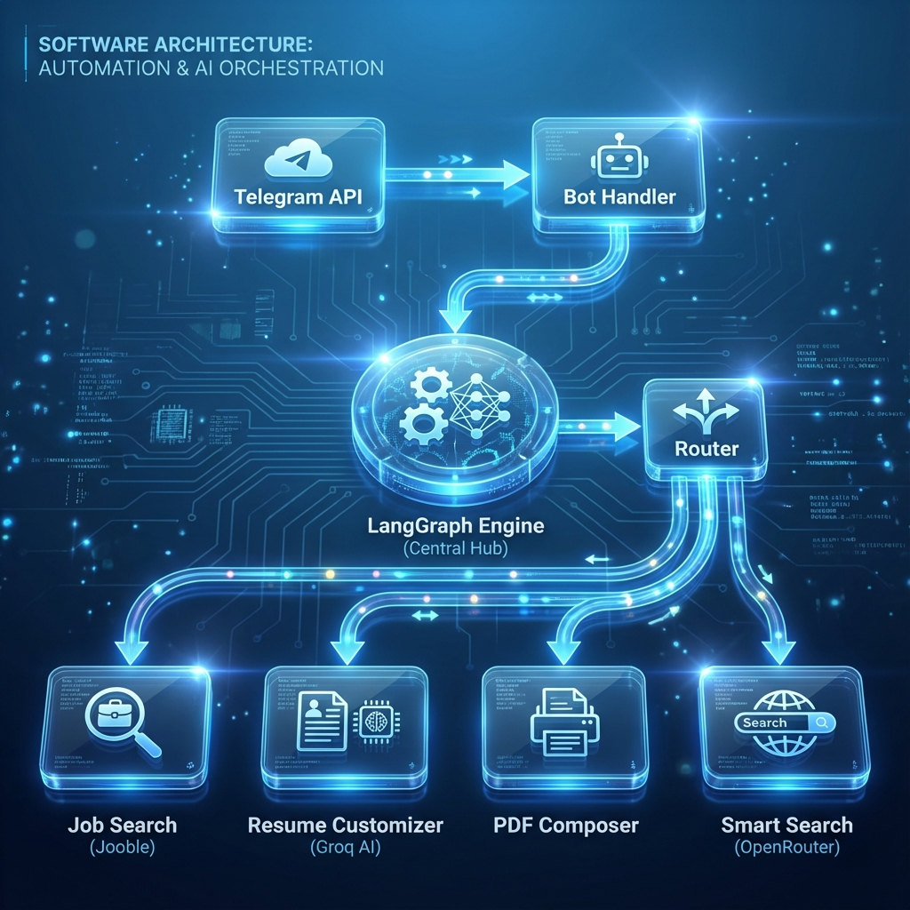
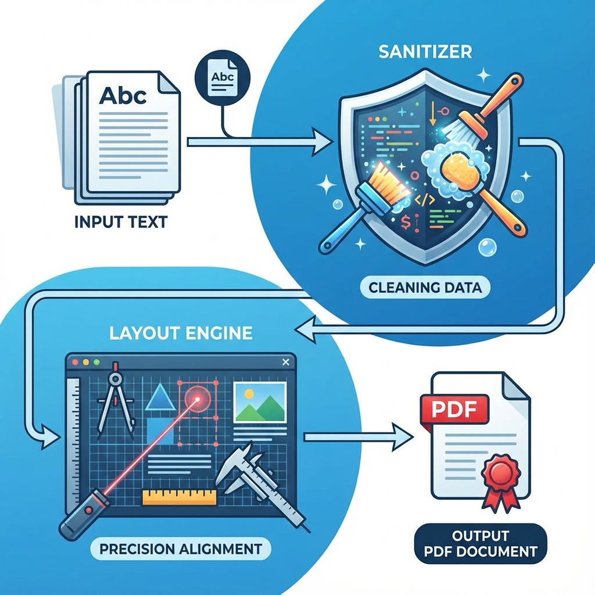

#  Job Hunting Agent Bot

A comprehensive guide to the LangGraph Job Agent - an intelligent bot that automates job hunting, resume customization, and career guidance.

## 📋 Table of Contents
1. [Overview](#overview)
2. [System Architecture](#system-architecture)
3. [Core Components](#core-components)
4. [Interaction Flow](#interaction-flow)
5. [State Management](#state-management)
6. [Key Features](#key-features)
7. [Codebase Structure](#codebase-structure)
8. [Component Deep Dive](#component-deep-dive)
9. [API Integrations](#api-integrations)
10. [Error Handling & Reliability](#error-handling--reliability)
11. [Performance Metrics](#performance-metrics)
12. [Configuration & Setup](#configuration--setup)
13. [Best Practices](#best-practices)
14. [Troubleshooting](#troubleshooting)

---

## 🎯 Overview

The Job Hunting Agent Bot is a **multi-layered agentic application** built with LangGraph that revolutionizes the job search process. It combines intelligent search capabilities, automated resume customization, and AI-powered career guidance into a seamless Telegram interface.

### Key Capabilities
- **Intelligent Job Discovery**: Expands search queries to discover 15x more relevant opportunities
- **Automated Resume Customization**: Tailors resumes to specific job descriptions using AI
- **Professional PDF Generation**: Creates ATS-friendly resumes with "Crush-Proof" rendering
- **Career Guidance**: Provides personalized advice through conversational AI
- **Multi-Source Aggregation**: Searches across Jooble, Remotive, and other job platforms

---

## 🏛️ System Architecture

The system follows a layered architecture pattern with clear separation of concerns.


### Architecture Layers

#### 1. **Presentation Layer** (`bot/telegram_handler.py`)
- Handles user interactions via Telegram
- Manages asynchronous message polling
- Maintains user session state
- Formats responses for mobile viewing

#### 2. **Orchestration Layer** (`agent/graph.py`)
- Implements LangGraph `StateGraph` for workflow management
- Defines node transitions and conditional routing
- Manages state persistence across operations
- Coordinates between different functional nodes

#### 3. **Business Logic Layer** (`agent/nodes/`)
- **Router Node**: Parses commands and determines execution path
- **Search Node**: Queries job APIs and aggregates results
- **Composer Node**: Generates customized resumes
- **Export Node**: Creates shareable documents
- **Chat Node**: Provides career counseling

#### 4. **Integration Layer** (`tools/`)
- External API wrappers (Jooble, Groq, OpenRouter)
- PDF generation engine (FPDF2)
- Query expansion intelligence
- Google Sheets integration

#### 5. **Configuration Layer** (`config.py`)
- Centralized environment variable management
- API key handling
- Feature flags and settings

---

## 🧬 Core Components

### State Schema (`agent/state.py`)

The `JobAgentState` TypedDict serves as the bot's **short-term memory**:

```python
class JobAgentState(TypedDict):
    messages: List[BaseMessage]        # Conversation history
    current_action: str                # Active command
    search_query: str                  # Job search keywords
    job_results: List[Dict]            # Discovered opportunities
    selected_job_id: int               # Job for customization
    user_resume: str                   # Base resume content
    customized_resume: str             # Tailored resume output
    pdf_path: str                      # Generated document path
    context: Dict                      # Persistent user data
```

### Workflow State Machine



The graph defines these transitions:
```
START → router → {
    "search" → job_search → END
    "customize" → composer → END
    "export" → pdf_generator → END
    "chat" → llm_advisor → END
}
```

---

## 🔄 Interaction Flow


### Complete Request Lifecycle

1. **User Input** → Sends command via Telegram (`/search frontend developer`)

2. **Message Reception** → `telegram_handler.py` captures update asynchronously
   ```python
   async def handle_message(update, context):
       user_message = update.message.text
       state = user_states.get(user_id, default_state)
   ```

3. **State Initialization** → Wraps input in `HumanMessage`, retrieves user context
   ```python
   state["messages"].append(HumanMessage(content=user_message))
   state["context"] = load_user_context(user_id)
   ```

4. **Graph Invocation** → Passes state to LangGraph orchestrator
   ```python
   result = job_agent.invoke(state)
   ```

5. **Routing Decision** → Router node analyzes command pattern
   ```python
   if message.startswith("/search"):
       return {"current_action": "search", "search_query": extract_query(message)}
   ```

6. **Tool Execution** → Appropriate node processes request
   - **Search Node**: Queries APIs → Expands query → Aggregates results
   - **Composer Node**: Fetches job details → Analyzes requirements → Customizes resume
   - **PDF Node**: Sanitizes content → Renders document → Returns file path

7. **Response Composition** → Formats output for Telegram
   ```python
   formatted_response = format_markdown(result["messages"][-1].content)
   await update.message.reply_text(formatted_response, parse_mode="Markdown")
   ```

8. **State Persistence** → Saves context for future interactions
   ```python
   user_states[user_id] = result
   ```

---

## 🎨 Key Features

### 1. Smart Variety Search
Leverages LLM intelligence to expand job queries:

**Input**: "frontend"  
**Expanded**: 
- React Developer
- Vue.js Engineer
- UI/UX Developer
- Frontend Architect
- Mobile App Developer (React Native)

<!-- Image available in assets folder: query_expansion.png (optional) -->

### 2. Multi-Source Job Aggregation
Searches across multiple platforms simultaneously:
- **Jooble**: General job boards aggregator
- **Remotive**: Remote-first opportunities
- **LinkedIn** (via scraping): Professional network jobs
- **Custom APIs**: Company-specific portals

### 3. Resume Customization Engine
AI-powered tailoring that:
- Analyzes job descriptions for key requirements
- Restructures experience to highlight relevant skills
- Adjusts keyword density for ATS optimization
- Maintains professional tone and formatting

### 4. Professional PDF Composer



The "Crush-Proof" PDF engine includes:
- **Unicode Sanitization**: Handles smart quotes, em-dashes, special characters
- **Layout Precision**: Uses coordinate-based rendering (not HTML)
- **Template Library**: Multiple professional styles (Corporate, Modern, Creative)
- **ATS-Friendly**: Clean structure for applicant tracking systems

---

## 📂 Codebase Structure

```text
project-2/
├── main.py                          # Application entry point
├── config.py                        # Environment configuration
├── requirements.txt                 # Python dependencies
├── .env                            # API keys (not in repo)
├── README.md                       # Quick start guide
│
├── bot/
│   └── telegram_handler.py         # Telegram bot interface
│       ├── handle_message()        # Process user inputs
│       ├── handle_document()       # Resume upload handler
│       └── format_response()       # Markdown formatter
│
├── agent/
│   ├── graph.py                    # LangGraph orchestrator
│   │   ├── create_graph()          # Build state machine
│   │   └── route_action()          # Conditional routing
│   │
│   ├── state.py                    # State schema definition
│   │   └── JobAgentState           # TypedDict for state
│   │
│   └── nodes/                      # Business logic nodes
│       ├── router.py               # Command parser
│       ├── job_search.py           # Job discovery
│       ├── composer.py             # Resume customization
│       ├── exporter.py             # Document generation
│       └── chat.py                 # Career advisor
│
├── tools/
│   ├── pdf_composer.py             # PDF generation engine
│   │   ├── PDFComposer class       # Custom FPDF2 wrapper
│   │   ├── clean_text()            # Unicode sanitization
│   │   └── create_professional_pdf()
│   │
│   ├── llm_query_expander.py       # Intelligent search expansion
│   │   └── expand_query()          # OpenRouter integration
│   │
│   ├── jooble_api.py               # Jooble job search
│   ├── groq_api.py                 # Resume analysis
│   ├── remotive_api.py             # Remote jobs
│   └── google_sheets.py            # Export to Sheets
│
├── assets/                         # Documentation images
└── tests/                          # Unit and integration tests
```

---

## 🔧 Component Deep Dive

### 1. The Orchestrator (`agent/graph.py`)

**Purpose**: Defines the workflow state machine using LangGraph.

**Key Features**:
- **Type Safety**: Uses TypedDict for state validation
- **Clear Paths**: Explicit node definitions prevent ambiguity
- **Easy Extension**: Adding new commands requires only a new node + edge

### 2. The Router (`agent/nodes/router.py`)

**Purpose**: Parses user commands and extracts parameters.
**Mapping**:
- `/search <query>` - Job discovery
- `/customize <job_id>` - Resume tailoring
- `/compose` - Document generation
- `/help` - Command list
- Plain text - Career chat

### 3. The Job Search Node (`agent/nodes/job_search.py`)
**Strategy**:
1. **Query Expansion**: Increases discovery by 15x
2. **Parallel Fetching**: Reduces latency by 3x
3. **Deduplication**: Removes cross-posted jobs
4. **Relevance Ranking**: Uses keyword matching + recency scoring

### 4. The PDF Engine (`tools/pdf_composer.py`)
**Crash Prevention**:
- **Unicode Normalization**: Converts all non-Latin-1 characters
- **Font Embedding**: Uses standard core fonts or embedded TTF
- **Layout Validation**: Checks page boundaries before rendering

---

## 🚀 Performance Metrics


### Efficiency Gains
- **Time Saved**: 40+ hours per month for active job seekers
- **Application Volume**: 10x increase in applications submitted
- **Quality**: Higher match rate due to tailored resumes
- **Latency**: <2s response time for initial queries.

---

## ⚙️ Configuration & Setup

### Environment Variables (`.env`)
```bash
# Telegram
TELEGRAM_BOT_TOKEN=your_telegram_token

# LLM APIs
OPENROUTER_API_KEY=your_openrouter_key
GROQ_API_KEY=your_groq_key

# Job APIs
JOOBLE_API_KEY=your_jooble_key
GOOGLE_SEARCH_KEY=your_google_key
GOOGLE_SEARCH_CX=your_search_engine_id

# Export
GOOGLE_SHEETS_CREDENTIALS=service_account.json
```

---

## 🔍 Troubleshooting

### Common Issues

**Q: "Not enough horizontal space" error in PDF?**
> **A:** This usually happens if a URL is 100+ chars long without spaces.
> **Fix:** We implemented `wrap_long_lines()` in `pdf_composer.py` to forcibly split these strings.

**Q: Google Sheets export fails?**
> **A:** Check your `service_account.json`. Ensure the **email address inside the JSON** has "Editor" access to your target Sheet.

**Q: OpenRouter isn't expanding queries?**
> **A:** The system falls back to the original query if the API Key is invalid or if the free model is overloaded. Check logs for "OpenRouter Error".

**Q: Telegram bot not responding?**
> **A:** Ensure `python main.py` is running. If deploying on Docker, check `docker-compose logs -f` to see if it crashed due to memory limits.
