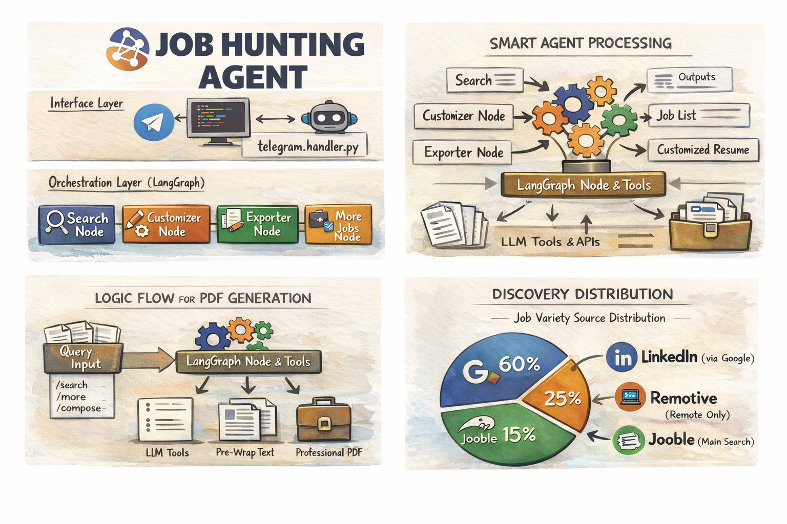

[](https://www.python.org/downloads/)
[](https://langchain-ai.github.io/langgraph/)
[](https://groq.com/)
[](https://workspace.google.com/products/sheets/)
[](https://core.telegram.org/bots)
[](https://opensource.org/licenses/MIT)

An advanced, agentic Telegram bot designed to automate the end-to-end job application process. Built with **LangGraph** for robust state management and **Groq/OpenRouter** for high-speed AI reasoning.

---

## 🚀 Key Features

- 🧠 **Smart Variety Search** - Expands search queries into related fields using OpenRouter (e.g., "ML" -> "AI Engineer", "Data Scientist") to provide diverse opportunities.
- 🌐 **Multi-Platform Extraction** - Combines top results from **Jooble**, **Remotive**, and **LinkedIn** (via Google Custom Search).
- 📄 **Professional PDF Composer** - Generates "LaTeX-style" job applications with corporate styling, automated name extraction, and robust Unicode handling.
- 💬 **Career Advice Mode** - Context-aware `/chat` command for career coaching, resume feedback, and job matching analysis.
- 📊 **One-Click Export** - Automatically formats and inserts job leads into a **Google Sheet** for tracking.

---

## 🎥 Demo & Preview

> https://github.com/user-attachments/assets/fb3191f6-9d2a-412c-bcae-9097ef42dd20

[Download/View PDF Documentation](./assets/demo.pdf)
---

## 📖 In-Depth Documentation

For a detailed breakdown of the system architecture, code modules, and advanced logic, please see:
### 👉 **[Technical Documentation](DOCUMENTATION.md)**

---

## 🛠️ Setup & Installation

### 1. Prerequisites
- Python 3.10+
- A Telegram Bot Token ([@BotFather](https://t.me/botfather))
- API Keys for Groq, Jooble, and OpenRouter (All Free Tier)

### 2. Installation
```bash
git clone <repository-url>
cd project-2
pip install -r requirements.txt
```

### 3. Configuration
Copy `.env.example` to `.env` and fill in your credentials.
```bash
cp .env.example .env
```

### 4. Google Services Setup (Required)
The bot needs two Google permissions to function fully:

**A. For Sheets Export (`/export`)**:
1. Go to [Google Cloud Console](https://console.cloud.google.com/).
2. Create a Project > Enable **Google Sheets API** & **Google Drive API**.
3. Create a **Service Account** > Create Key (JSON).
4. Save the file as `service_account.json` in the project root.
5. **Important**: Share your target Google Sheet with the service account's email address (found in the JSON).

**B. For LinkedIn Scraping (`/more`)**:
1. Go to [Programmable Search Engine](https://programmablesearchengine.google.com/).
2. Create a new engine > Search specific sites > Add `linkedin.com/jobs`.
3. Copy the **Search Engine ID (CX)** to `.env`.
4. Go to [Google Custom Search API](https://developers.google.com/custom-search/v1/overview) > Get API Key.
5. Add the key to `.env` as `GOOGLE_SEARCH_KEY`.

---

## 🎮 Commands & Usage

| Command | Action |
|:---|:---|
| `/resume` | 📤 **Upload** your base resume (PDF/Text) |
| `/search <query>` | 🔍 **Discovery** - Initial search across main platforms |
| `/more` | 🧬 **Expansion** - Smart Variety Search (OpenRouter + GSearch) |
| `/customize <id>` | 🛠️ **Tailoring** - AI-powered resume & cover letter adaptation |
| `/compose` | 📄 **Generation** - Receive your high-quality PDF application |
| `/export` | 📈 **Tracking** - Save current leads to Google Sheets |
| `/chat <msg>` | 🗣️ **Coaching** - Discuss jobs or get resume feedback |

---

## 🗂️ File Guide & Structure

### 🧠 Core Agent Logic
- **`main.py`**: The entry point. Initializes the Telegram application and validates environment variables.
- **`agent/graph.py`**: The "brain" of the agent. Defines the LangGraph workflow, including nodes (logic steps) and edges (transitions).
- **`agent/state.py`**: Defines `JobAgentState`, the shared memory dict passed between nodes (stores query, jobs, resume text).
- **`agent/nodes/router.py`**: The decision maker. Parses user input (`/search`, `/compose`) and routes to the correct node.

### 🤖 Telegram Bot Layer
- **`bot/telegram_handler.py`**: Handles all Telegram API interactions. Listen for messages, manages user state, and calls the LangGraph agent asynchronously.

### 🛠️ Specialized Tools (`tools/`)
- **`tools/pdf_composer.py`**: A powerful `fpdf2`-based engine that generates "LaTeX-style" PDF resumes and cover letters. Includes crash-proof logic for weird characters.
- **`tools/llm_query_expander.py`**: Uses OpenRouter (Gemma/Llama) to expand 1 keyword into 5+ related job titles for the `/more` command.
- **`tools/extra_jobs_api.py`**: Scrapes Remotive and Google Search (LinkedIn) to find diverse job listings.
- **`tools/jooble_api.py`**: Interface for the Jooble job search API.
- **`tools/groq_llm.py`**: Handles all high-speed inference for resume customization via Groq.
- **`tools/sheets_writer.py`**: Connects to Google Sheets to export job leads.

### ⚙️ Configuration
- **`config.py`**: Centralized configuration class loading from `.env`.
- **`requirements.txt`**: List of all Python dependencies.

---

## 📄 License
Distributed under the MIT License. See `LICENSE` for more information.
